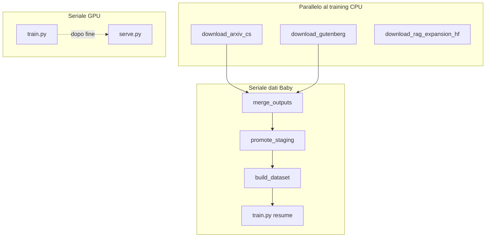

# Eubot — sintesi operativa (pod, dati, scheduling)

**Ultimo snapshot pod (verifica SSH):** 2026-03-27 ~06:45 UTC — host tipico `root@194.68.245.207:22125`, chiave `~/.ssh/eubot_ed25519`. Gli IP/porte cambiano se ricrei il pod RunPod.

**Stato runtime dettagliato (train / burst / orchestrator, comandi sicuri SSH):** [RUNPOD_STATUS.md](RUNPOD_STATUS.md). Script pod: [`tools/runpod_full_utilization.sh`](../tools/runpod_full_utilization.sh).

**Training (2026-03-28):** `eurobot_baby/scripts/train.py` — resume con scheduler allineato (`last_epoch` o stato da checkpoint), salvataggio `optimizer.pt`/`scheduler.pt` nei `step_*`, AMP con skip loss non finite, grad clip dopo `unscale_`, log throughput `[TRAIN][PERF]`. **Dual-mode (train + inferenza live):** [`tools/start_serve_safe.sh`](../tools/start_serve_safe.sh) avvia `serve.py` su **checkpoint statico** `serve_checkpoint` in **CPU** mentre il train usa la GPU; niente secondo modello in VRAM. **Non** due carichi pesanti sulla stessa GPU.

---

## 0. Politica: sfruttare la macchina al massimo

**Obiettivo operativo:** usare in parallelo **CPU, rete e GPU** disponibili sul pod **senza conflitti**. Su macchine con **molti vCPU** (es. ~96) e **una GPU**, durante il `train.py` si lancia in background tutto ciò che è **compatibile**: download/scraping/HF, harvest dialoghi, merge verso `raw_staging`, corpus aggiuntivi con directory di output distinte, e ogni altro job che **non** competi sulla stessa GPU.

**Sempre fare paralleli** (con `nohup`, `nice`, log separati) quando è sicuro: non lasciare il pod “quasi idle” solo perché il training è attivo. **Rilanciare ondate** di download quando i job precedenti sono terminati (`runpod_parallel_cs_and_chat_data.sh` e supplementi sotto). Il **load average** resterà una piccola frazione di `nproc`: è normale; l’importante è **GPU impegnata** dal training e **CPU/rete** occupate dai job dati.

**Non fare:** `serve.py` insieme a `train.py` sulla stessa GPU; due `train.py`; due istanze sullo stesso output (es. harvest dialoghi senza lock); `build_dataset`/promote che sostituiscono il `train.jsonl` del run attivo; **non** rilanciare `parallel_cs` mentre **`download_arxiv_stem.py`** è ancora in esecuzione (duplicherebbe arXiv).

---

## 1. Stato attuale pod (riferimento)

| Voce | Valore osservato |
|------|------------------|
| **Training** | **Run 918672 completato** (`Training finished` in `/root/train_baby_newround.log`); ultimo checkpoint `models/checkpoints/step_918672`. **Nessun** `train.py` attivo finché non si ricalcola `max_steps` dopo un nuovo `build_dataset`. |
| **Serve (post-training)** | [`restart_serve_baby_safe.sh`](../tools/restart_serve_baby_safe.sh) sull’ultimo `step_*` — stessa GPU, **non** insieme a `train.py`. Health: `curl http://127.0.0.1:8080/health` (log tipico `/root/serve_baby.log`). GPU può restare ~0% in idle; VRAM ~centinaia MiB se il modello è caricato. |
| **Obiettivo run precedente** | `max_steps: 918672` nel YAML del round completato; **prossimo** run solo dopo merge/promote (se applicabile), `build_dataset`, nuovo `train.jsonl`, nuovi `max_steps`. |
| **Dataset** | `train.jsonl` del round completato resta sotto `data/processed/` fino al prossimo rebuild. |
| **Download paralleli (CPU)** | Ondata [`runpod_parallel_cs_and_chat_data.sh`](../tools/runpod_parallel_cs_and_chat_data.sh): arXiv CS + Gutenberg computing + `download_rag_expansion_hf.py` (log `/root/parallel_cs_data_logs/`). **Supplementi** opzionali sotto `eurobot_baby/tools/scraping/` con **path assoluti** a `python` e script (vedi §2). Harvest dialoghi: [`runpod_parallel_dialogue_harvest.sh`](../tools/runpod_parallel_dialogue_harvest.sh), `REPO_ROOT=/workspace` se serve monorepo. |
| **Merge raw** | Dopo ogni ondata di download: `merge_outputs_to_raw_names.py` → `raw_staging`, poi `promote_raw_staging.sh` → `raw` quando si è pronti al prossimo `build_dataset` (non durante un `train.py` attivo sullo stesso `train.jsonl`). Automazione: [`runpod_finish_cs_merge_train.sh`](../tools/runpod_finish_cs_merge_train.sh). |

**Log utili:** `/root/train_baby_newround.log`, `/root/dialogue_train_round.log`, `/root/parallel_cs_data_logs/*.log`, `/root/extra_dl_theology.log`, `/root/extra_dl_stem2.log`, `/root/extra_dl_gnosis.log`, `/root/extra_dl_rag2.log`, `/root/extra_dl_gut2.log`, `/root/parallel_cs_launch.log`, `/root/dialogue_parallel_harvest.log`

### Cronologia operazioni recenti (2026-03-27, SSH)

- Verifiche stato: training ~95% verso `max_steps`, GPU ~94–97%, **96 vCPU**, load tipico ~8–18 secondo job attivi.
- **Nuove ondate** `runpod_parallel_cs_and_chat_data.sh` quando Gutenberg/RAG della tornata precedente erano già terminati e arXiv ancora attivo (evitato rilancio duplicato finché arXiv girava).
- **Harvest dialoghi** (`REPO_ROOT=/workspace`): run breve con OK su `raw_dialogues.jsonl`; warning Reddit se manca `praw`.
- **Download supplementari** da `eurobot_baby/tools/scraping/`: teologia (fine), STEM, gnosis (possibili FAIL SSL/sorgenti), RAG HF + Gutenberg computing in ripetizione con **`/root/eurobot_baby_venv/bin/python -u /workspace/eurobot_baby/tools/scraping/<script>.py`** per evitare errori se la cwd non è `scraping/`.
- **Pitfall:** `nice -n 12 $PY -u script.py` con `$PY` non espanso correttamente in remoto → `nice` interpreta `-u` come propria opzione. Usare **path assoluto** a `python` e **path assoluto** allo script oppure `nice -n 12 -- /percorso/python -u script.py` dopo `cd` nella directory giusta.

---

## 2. Cosa può andare in parallelo vs in sequenza

Politica di utilizzo massimo: vedi **[sezione 0](#0-politica-sfruttare-la-macchina-al-massimo)**.

### Parallelo (CPU / rete, non competono con la GPU del training)

- **Download HF** (arXiv streaming, Gutenberg, `download_rag_expansion_hf.py`): script [`tools/runpod_parallel_cs_and_chat_data.sh`](../tools/runpod_parallel_cs_and_chat_data.sh) con `nohup` e log separati.
- **Corpus aggiuntivi** (stessa regola: solo CPU/rete, output separati): sotto `eurobot_baby/tools/scraping/` — es. [`download_theology_gutenberg.py`](../eurobot_baby/tools/scraping/download_theology_gutenberg.py), [`download_stem_gutenberg_science.py`](../eurobot_baby/tools/scraping/download_stem_gutenberg_science.py), [`download_gnosis_retry.py`](../eurobot_baby/tools/scraping/download_gnosis_retry.py); lanciare con path assoluti a `python` e allo script se non si è in `cd .../scraping`.
- **Scraping / harvest dialoghi** (pipeline `ai_engine.data_pipeline` con lock): [`tools/runpod_parallel_dialogue_harvest.sh`](../tools/runpod_parallel_dialogue_harvest.sh) — non due istanze sullo stesso `--out`.
- **Merge su disco** verso `raw_staging` mentre `train.py` gira: **consentito** se non si fa `build_dataset` sul file attivo del run corrente. Il merge **non** sostituisce `train.jsonl` finché non fai rebuild.

### Mai in parallelo sulla stessa GPU

- **`train.py` e `serve.py`**: uno solo ([`eurobot_baby/docs/BEST_PRACTICES_TRAINING.md`](../eurobot_baby/docs/BEST_PRACTICES_TRAINING.md)).
- **Due `train.py`** sullo stesso checkpoint/dataset.

### Sequenza obbligatoria (ordine pipeline dati Baby)

1. Download / scraping → `EUROBOT_SCRAPING_RUN/output/...`
2. [`merge_outputs_to_raw_names.py`](../eurobot_baby/tools/scraping/merge_outputs_to_raw_names.py) → `data/raw_staging` (o `raw`)
3. [`promote_raw_staging.sh`](../eurobot_baby/tools/scraping/promote_raw_staging.sh) se usi staging
4. **`build_dataset.py`** → nuovo `train.jsonl`
5. Ricalcolo **`max_steps`** e **`train.py --resume`**

Automazione one-shot dopo merge in staging senza rebuild: [`tools/runpod_finish_cs_merge_train.sh`](../tools/runpod_finish_cs_merge_train.sh) (`RUN_PROMOTE`, `RUN_BUILD_AND_TRAIN`).

### Schedulare “quando finisce il training” (nessun cron affidabile su RunPod)

| Obiettivo | Meccanismo |
|-----------|------------|
| Dopo `train.py` → ingest RAG + **serve** | [`tools/runpod_train_then_next.sh`](../tools/runpod_train_then_next.sh) + `CHAIN_SCRIPT=[runpod_post_train_plan.sh]` · entry: [`tools/runpod_schedule_post_train.sh`](../tools/runpod_schedule_post_train.sh) |
| Dopo `train.py` → catena dialoghi / export / secondo train | [`tools/runpod_schedule_dialogue_after_train.sh`](../tools/runpod_schedule_dialogue_after_train.sh) + `START_DIALOGUE_TRAIN=1` se serve secondo training |
| PID da attendere | `export WAIT_PID=<pid>` oppure `logs/train_resume.pid` ([`tools/runpod_write_train_pid.sh`](../tools/runpod_write_train_pid.sh)) |

Il waiter fa **polling** (`POLL_SEC`, default 120s); va lanciato **prima** che finisca il run con `nohup`.



---

## 3. Next steps consigliati

1. **Durante il run corrente:** monitor `tail -f /root/train_baby_newround.log`; tenere **job paralleli** attivi quando i download precedenti sono finiti ([sezione 0](#0-politica-sfruttare-la-macchina-al-massimo)); opzionale `export HF_HOME=/root/hf_home` e **`HF_TOKEN`** per rate limit Hub più alti ([`tools/runpod_ops_best_practices_check.sh`](../tools/runpod_ops_best_practices_check.sh)).
2. **A training finito:** ultimo `step_*` → [`tools/restart_serve_baby_safe.sh`](../tools/restart_serve_baby_safe.sh); verificare tunnel OVH → [`docs/EUBOT_OVH_HTTPS.md`](EUBOT_OVH_HTTPS.md).
3. **Mix conversazionale LM:** se vuoi pesare `expansion_training` nel prossimo `train.jsonl`, usare [`merge_expansion_into_train.py`](../ai_engine/training/merge_expansion_into_train.py) / [`tools/runpod_merge_expansion_lm_optional.sh`](../tools/runpod_merge_expansion_lm_optional.sh) prima di un nuovo run (vedi [`ai_engine/training/README.md`](../ai_engine/training/README.md)).
4. **Schedulare post-training:** impostare `nohup bash tools/runpod_schedule_post_train.sh` (o catena dialogue) **prima** della fine del run, con `WAIT_PID` o PID file coerente.
5. **Obiettivo qualità “prodotto”:** [`EUBOT_QUALITY_STACK.md`](EUBOT_QUALITY_STACK.md) (RAG, eval, eubot-coder, sage).

---

## 4. Grinder autonomo (max CPU/rete + check periodici)

Sul pod, con **training** in esecuzione sulla GPU, puoi lasciare a lungo:

- **Download paralleli** (arXiv CS, Gutenberg computing, HF RAG/conversazionale) rilanciati solo se nessuno dei tre processi è già attivo.
- **Check periodici** (train/serve, disco) su log unico.

**Script:** [`tools/runpod_autonomous_grinder.sh`](../tools/runpod_autonomous_grinder.sh) (da copiare sul pod se non già in `git pull`).

```bash
export HF_HOME=/root/hf_home
export HF_HUB_CACHE=/root/hf_home
# export HF_TOKEN=...   # consigliato
# Opzionale: harvest dialoghi in parallelo (CPU, lock pipeline)
# export EUROBOT_LAUNCH_DIALOGUE_HARVEST=1
# Opzionale: quando train.py NON è in esecuzione, merge solo su raw_staging (no build)
# export AUTO_FINISH_MERGE_STAGING=1
nohup bash /workspace/eubot/tools/runpod_autonomous_grinder.sh >> /root/eubot_autonomous_launch.log 2>&1 &
tail -f /root/eubot_autonomous.log
```

Variabili `MONITOR_INTERVAL_SEC` (default 900), `MAX_MONITOR_ITER` (0 = infinito), `EUBOT_AUTO_LOG` (default `/root/eubot_autonomous.log`).

**Nota:** rilanciare `runpod_parallel_cs_and_chat_data.sh` quando i download sono finiti **rigenera** una nuova ondata (stessi cap default); per aumentare volumi aumentare `EUROBOT_ARXIV_CS_MAX` / `RAG_EXPANSION_MAX` **prima** del lancio. Il grinder (`runpod_autonomous_grinder.sh`) **rilancia** `runpod_parallel_cs_and_chat_data.sh` nel loop di monitoraggio quando **nessuno** dei tre processi download è attivo e **non** c’è `train.py` in esecuzione (e all’avvio se la stessa condizione vale). Resta il divieto di sovrapporre due ondate mentre **`download_arxiv_stem.py`** è ancora in esecuzione.

---

## 5. Indice documenti collegati

| Documento | Contenuto |
|-------------|-----------|
| [`EUBOT_RUNPOD_RESUME.md`](EUBOT_RUNPOD_RESUME.md) | Resume training, waiter, post-training |
| [`EUBOT_QUALITY_STACK.md`](EUBOT_QUALITY_STACK.md) | Baby vs RAG vs Coder/Sage |
| [`EUBOT_BABY_QUALITY_REGRESSION.md`](EUBOT_BABY_QUALITY_REGRESSION.md) | Qualità risposta Baby: eval, serve, dataset |
| [`DEPLOY_SYNC_RUNPOD.md`](DEPLOY_SYNC_RUNPOD.md) | Deploy git/scp, CRLF, `bash -n` |
| [`EUBOT_OVH_HTTPS.md`](EUBOT_OVH_HTTPS.md) | HTTPS, tunnel OVH, checklist nuovo pod |
| [`DATASET_EXPANSION_RAG_AND_TRAINING.md`](DATASET_EXPANSION_RAG_AND_TRAINING.md) | HF expansion, ingest |
| [`eurobot_baby/docs/BEST_PRACTICES_TRAINING.md`](../eurobot_baby/docs/BEST_PRACTICES_TRAINING.md) | Checklist training |
| [`eurobot_baby/tools/scraping/SETUP_SCRAPER.md`](../eurobot_baby/tools/scraping/SETUP_SCRAPER.md) | raw vs raw_staging |
| [`EUROBOT_BABY_SENIOR_DEV_BRIEF.md`](EUROBOT_BABY_SENIOR_DEV_BRIEF.md) | Handoff architetturale + snapshot pod |
